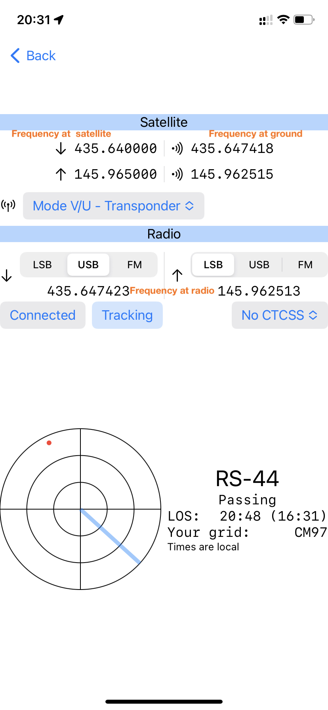

# Getting Started With SatHunter

## First Steps

### Required Settings

You need to change these settings on your IC-705 before connecting SatHunter to it.

Go to `MENU -> SET -> Connectors -> CI-V`, then:

- Make sure `CI-V Address` shows `A4h`.
- Set `CI-V Transceive` to `OFF`.
- Set `CI-V USB Echo Back` to `OFF`.

Warning: SatHunter may malfunction if these settings are not set to expected values. Symptoms: 

- Wrong VFO frequencies are shown.
- VFO frequences are not correctly set periodically when tracking a satellite.
- SatHunter is unable to establish Bluetooth connection with your IC-705.

### Pair SatHunter With Your IC-705

Go to `MENU -> SET -> Bluetooth Set`, then select `<<Pairing Reception>>`. A dialog will indicate
that the radio is waiting for a paring request.

Start SatHunter, then choose any satellite, then tap `Connect`. Then wait until the `Connect` button
changes to `Connected`. With my iPhone (XR), it usually takes less than 30 seconds.

You only need to do this once. As long as your IC-705 has Bluetooth enabled, next time when you tap the
`Connect` button, SatHunter should establish the connection in less than 10 seconds. Please give SatHunter
permission to use Bluetooth when asked.

When pairing, SatHunter generates a unique ID which is stored locally on your iPhone. Your IC-705 remembers
this ID and will recognize SatHunter without needing to re-pair. You can re-generate this ID in SatHunter's
`Settings` view (then you need to re-pair with the IC-705).

## Operating Logic

What you can expect SatHunter to do:

- Take care of adjusting VFOs for doppler shift.
- Provide best-effort help to set transponder frequencies and modes. 
  SatHunter relies on data provided by [AMSAT](https://www.amsat.org) 
  and [SatNOGS](https://satnogs.org) for satelite keplerian elements 
  and transponder profile.
- Provide visual aid to help you aim the antenna at the satellite.

What SatHunter assumes:

- VFO-A is downlink and is the main VFO; VFO-B is uplink.
  - Do not switch the main VFO when SatHunter is controlling the radio.
  - Do not push the `XFC` button on the radio when SatHunter is in
    control.
- Split is enabled.
  - SatHunter turns on split when it starts tracking a frequency, but 
    you should not turn it off when SatHunter is in control.

What you should do:

- Turn the VFO-A when working linear satellite to look for contacts.
- Be the antenna rotator.
- Plan ahead your field day. SatHunter is not a pass planner. Use a
  better tool like [gpredict](http://gpredict.oz9aec.net) to figure
  out when you have the best chance to work ISS.
- Be a good operator. You are likely operating half-duplex when using
  SatHunter. Be aware that you may stomp upon someone else because
  you can't hear yourself. And due to transponder frequency shift, and
  IC-705's LO frequency shift, the uplink frequency may not perfectly
  "match" the downlink frequency, regardless how accurate the 
  calculation is. *Always listen before transmitting.*

What you may want to do:

- Mount your iPhone on your antenna. If you are using an Elk or an 
  Arrow, consider purchasing a "bike handle phone mount" and install
  it on the antenna handle.

- Map your speaker-mic's Up / Down button to main VFO tuning. You may
  find it useful when working linear satellites.

## Operating Guide

### Connect to IC-705
It's similar to the pairing process shown above. The connection persists
across different satellite passes.

### Satellite view

#### Frequency display
3 Groups of frequencies are shown in this view. They are annotated
below.

#### Tracking status
The `Track/Tracking` toggle determines how SatHunter controls the radio.

When `Tracking`, SatHunter tries to lock on the current frequencies
at satellite -- it adjusts VFO A and B so that the numbers on the
top-left side do not change.

When not `Tracking`:

- if a transponder is not selected, or the transponder is not a linear
  transponder, SatHunter does not control the radio.
- if a linear transponder is selected, SatHunter will control the VFO B
  (uplink frequency) to "match" VFO A with
  [Full Doppler Tuning](https://www.amsat.org/wordpress/wp-content/uploads/2015/02/FDT-WA4SCA.pdf).
  Here's how it works:
  - Periodically, SatHunter computes the ground frequencies of the
    transponder's frequency range. Then it computes the difference
    between VFO A and the (adjusted for ground) lower bound of the
    transponder's downlink frequency. Then it applie the difference
    on top of one of the transponder's uplink frequency bounds,
    depending on whether the transponder is inverted.

### Work FM Satellites

Select the FM transponder. Tracking is automatically turned on. Enjoy.

### Work Linear Satellites

- Select the linear transponder. Tracking is automatically turned on and
  the VFOs are set to the mid of the linear transponder's range.

- Turn off tracking and tune VFO A (the main VFO knob) to look for
  signal / a place to call CQ.
    - If you have tuned out of the downlink frequency range of the
      selected transponder, the radio frequency display will turn red.

- Once you find a signal / frequency, turn on tracking to lock on that
  signal. If the other side is also using Full Doppler Tuning, you
  should be able to have a hassle-free QSO (in theory :D).

## Maintenance

Update the TLE and transponder information often. You can do that in
the Settings view (the gear icon at the top-right corner in the 
satellite list view).

